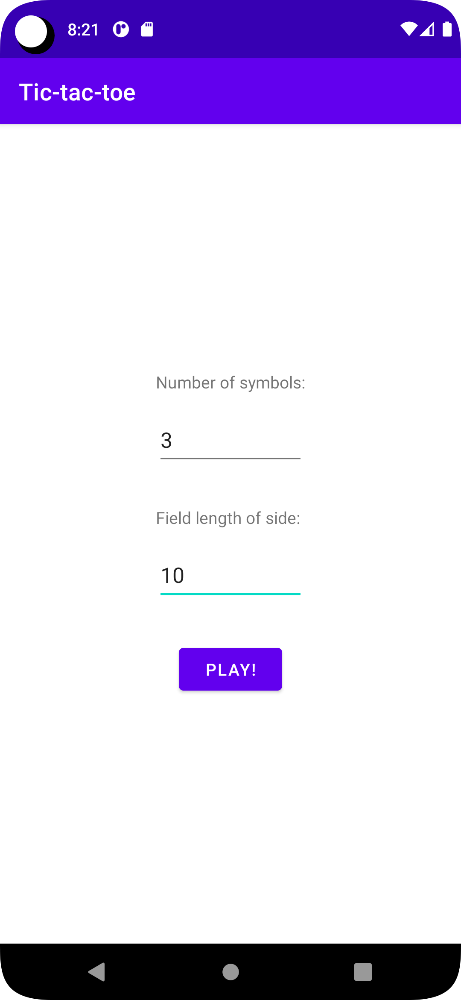
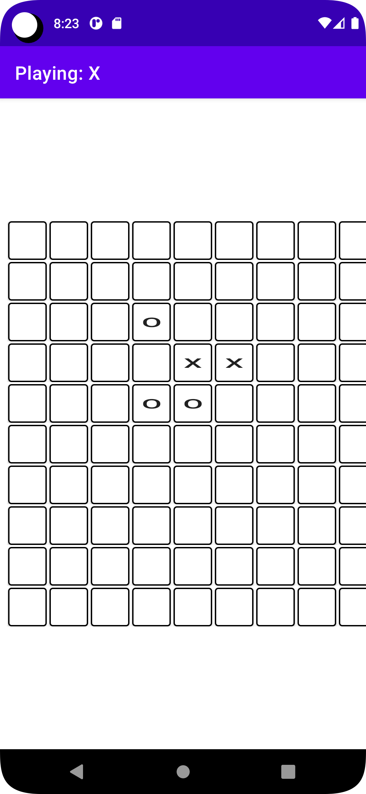
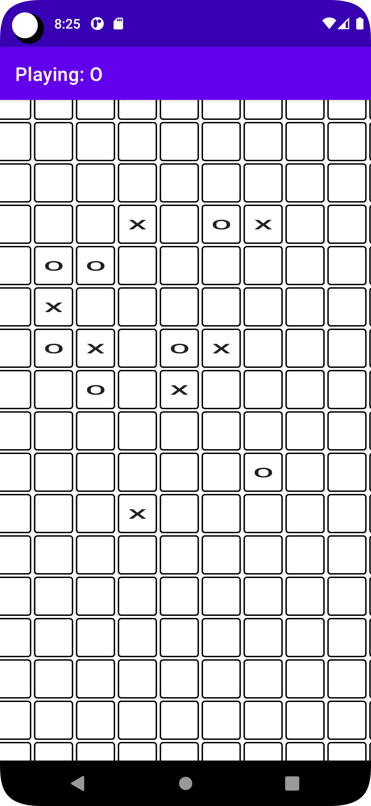
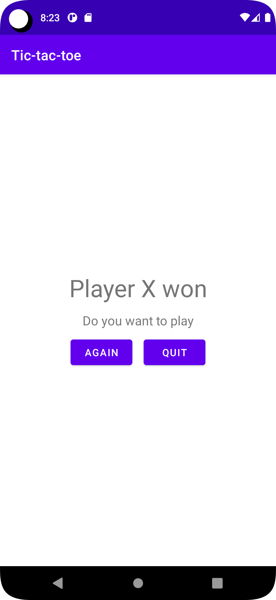

# Tic-tac-toe
## Description
Classic Tic-tac-toe app on Android from version 28. Implemented feature to adjust size of field and also customizable number of symbol in row for winning condition.

